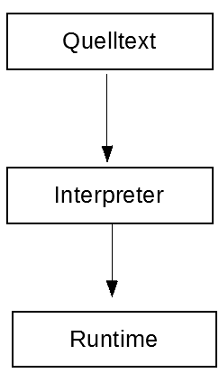

# Willkommen zum Java Guide der FOI 12

## Inhaltsverzeichnis

- [Eine Einführung](#eine-kurze-einführung)
- [Die JVM](#die-jvm)
- [Programme die wir benötigen](#programme-die-wir-benötigen)
- [Wie geht es weiter ?](#wie-geht-es-weiter-)
---


## Eine kurze Einführung

### Wie lerne ich Programmieren bzw. Java ?
---
Um die Konzepte der Programmierung zu verstehen, muss man etwas weiter ausholen. Dir muss klar sein, dass einfaches Lesen des Guides dich nicht zum Master of the Universe macht. Programmieren lernt man dadurch, dass man programmiert. Learning by doing ist das Stichwort. 

Also los geht's!

---

### Ein paar generelle Sachen zur Programmierung
---
Wie auch in unserer Sprache gibt's es verschiedene Programmiersprachen. Es gibt z.B C, C++, Python, Java usw.
Der große vorteil liegt aber darin, wenn Du eine Sprache kannst, hast Du es leicht weitere zu erlernen. Da die Konzepte gleich bleiben, es ist völlig egal, ob ich eine Software in Java oder C++ schreibe. Die Programmiersprache ist nur das Werkzeug. Natürlich brauchen spezielle Programme auch spezielle Techniken. Du kannst z.B schlecht einen Treiber für einen USB-Stick mit Java schreiben. Dafür wird eher C verwendet, da Java nicht sehr hardwarenah ist, aber dazu später mehr.

---

### Worin unterscheiden sich die Programmiersprachen ?
---
Es gibt 3 Typen von Programmiersprachen, die ***Compiler-,***  ***Interpreter-*** und die sogenannten ***Bytecodesprachen***.

Hä was?!

---

#### Compilersprachen

Die Compilersprachen sind vereinfacht gesagt, Sprachen die vom Computer in Maschinencode umgewandelt werden, also das typische 
```c
01001101 01100001 01101100 01110100 01100101 00100000 01101001 01110011 01110100 00100000 01110011 01100101 01111000 01111001 
```

**Vorteile**: sehr schnell, sehr hardwarenah, sehr geil  
**Nachteile**: Fehler werden meistens erst spät erkannt, es muss sehr viel auf die Hardware geachtet werden, meistens nicht plattformübergreifend

Compilersprachen sind z.B **C**, **C++** oder auch **Assembler**.

So sieht's im Prozess aus:


Der Prozess ist hier aber sehr **vereinfacht**.

---

#### Interpretersprachen
Wie der Name schon sagt, werden diese Sprache interpretiert. Doch was heißt das?

Du hast eine Datei, die wird von einem Programm eingelesen und ausgeführt. Das spart Zeit, da man diese Datei nicht noch compilern muss. 

**Vorteile**: kein Compiler ist nötig, plattformunabhängig, Fehler werden bei der Laufzeit erkannt  
**Nachteile**: langsamer als Compilersprachen, nicht hardwarenah

Interpretersprachen sind z.B **Ruby**, **Python**, **JavaScript** oder **PHP**.

Der Prozess sieht etwa so aus:



Aber auch hier gilt, sehr **vereinfacht**.

---
#### Bytecodesprachen

Kommen wir zur letzen Sprachenart, die Bytecodesprachen. Bei den ***Bytecodesprachen*** handelt es sich um eine Mischung aus ***Compiler-*** und ***Interpretersprachen***.
Die beiden Techniken werden sozusagen vereint. Dazu gehört aber noch eine VM *(Virtual Machine)*. Die VM übernimmt das Compilern und Ausführen.

Die Dateien werden am Anfang interpretiert und in Bytecode umgewandelt. Danach wird dieser Bytecode von der VM kompiliert und ausführbar gemacht.

Nach der Kompilierung fehlt noch die VM. Ohne kann das Programm nicht ausgeführt werden. Also muss man diese VM installiert haben, um damit arbeiten zu können und um Programme auszuführen.

**Vorteile**: plattformunabhängig, meistens schneller als Interpretersprachen  
**Nachteile**: langsamer als Compilersprachen, nicht hardwarenah

Bytecodesprachen sind z.B **Java**, oder **C#**.

---

## Die JVM

---

Hier erkläre ich kurz die JVM. Da wir gelernt haben, dass Java eine Bytecodesprache ist, benötigt sie auch eine VM. Und jetzt ratet mal was JVM heißt.  

Richtig, *Java Virtual Machine* kurz ***JVM***.
Darin wird unser gesamter Javacode verarbeitet und bei Bedarf ausgeführt.

Der Aufbau der ***JVM***: <br /> <br />


*Sieht kompliziert aus. Ist es auch. Wir kommen darauf später zurück.*

---

## Programme die wir benötigen

---

### Die JVM bzw. das JDK
Wie gesagt wird Java benötigt, umb die JVM zu schreiben. Aber auch zusätzliche Programme wie *JavaDoc*. Ich gehe darauf später näher ein. Wir laden uns das JDK (Java Development Kit) herunter. Ihr könnt es euch [hier](http://www.oracle.com/technetwork/java/javase/downloads/jdk8-downloads-2133151.html) herunterladen. Wählt eure Plattform aus und installiert das JDK.


### Einen Editor oder eine IDE
Natürlich brauchen wir einen Editor, um unsere Quelltexte zu schreiben. Ich benutze dafür [Visual Studio Code](https://code.visualstudio.com). Einen sehr flexiblen und schnellen Code Editor. Ihr könnt ihn euch [hier](https://code.visualstudio.com/download) runterladen. Natürlich könnt Ihr auch andere Editoren benutzen. Alternativen sind [Atom](https://atom.io), [Sublime Text](https://www.sublimetext.com/) und [Notepad++](https://notepad-plus-plus.org/).

Wenn Ihr lieber eine IDE (Integrated Development Environment) benutzen wollt empfehle ich ***Intellij*** oder ***Eclipse***.

Ich schreibe für alle drei Programme (VSCode, IntelliJ und Eclipse) einen Guide. Guck dafür weiter unten.

---

## Wie geht es weiter ?

Nun fragst Du dich sicher, **Und jetzt ?**
Im nächsten Kapitel werden wir uns die IDE Eclipse anschauen, damit alles reibungslos in die Programmierung übergehen kann. Klick dafür [hier](/docs/Editor-und-IDE/Eclipse.md).

Eine weitere Sache, die vorteilhaft wär', ist, dass Du Git lernst. Es ist ganz einfach klick dafür [hier](https://github.com/FOI-12/Getting-Started). Lies es dir in Ruhe durch. Du findest Git im Abschnitt **Informationen** (Ganz oben).

