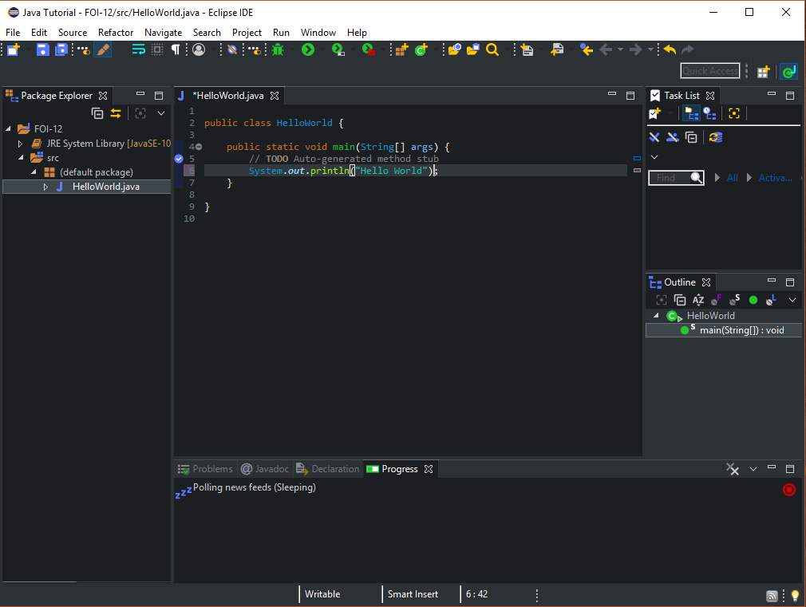

# Einführung in Eclipse


## Inhaltsverzeichnis


- [Vorwort](#vorwort)
- [Installation](#installation-von-eclipse)
- [Einrichtung](#die-einrichtung)


---


## Vorwort


Um ist mit dem Programmieren anzufangen, benötigen wir natürlich ein Programm, dass uns ermöglicht Quelltexte zuschreiben. In diesem Guide nehmen wir uns die IDE **Eclipse** vor.
Eclipse eignet sich gut, um in die Java Programmierung einzusteigen. Wir beginnen nun mit der Installation. 


---


## Installation von Eclipse


---


Wir laden uns als erstes Eclipse auf der [Homepage](https://www.eclipse.org/downloads/) herunter. Wählt dort **Download 64 Bit** aus, Ihr werdet auf eine Seite weitergeleitet und der Download startet automatisch.


Nach dem Herunterladen öffnet Ihr das **.zip** Archiv und startet die dort liegende ***.exe***.
Es startet nun ein Programm mit dem Ihr Eclipse installieren könnt. 


Wählt dort nun ***Eclipse IDE for Java Developer*** aus. Ihr werdet anschließend nach dem Installationspfad gefragt, wählt diesen nach Belieben aus. Jetzt wartet Ihr, bis Eclipse installiert ist und dann war es das schon. 


## Die Einrichtung


Als ersten Schritt öffnen wir Eclipse.


Ihr findet auch bei diesem Fenster wieder.


Wählt dort einen Ort aus, wo Ihr Eure Projekt abspeichern wollt. Ihr könnt ihn jederzeit ändern oder auch mehrere Workspaces benutzen.


---


Als Nächstes wird uns ein großes Fenster mit vielen Dingen angezeigt. Klick oben Rechts auf Package Explorer. Danach sollte es etwa so aussehen.


---


Klickt nun mit der rechten Maustaste auf Package Explorer, wählt danach *New → Java Project* aus. Danach erscheint sowas hier. Gibt dort einfach genau die Sachen ein, die im Screenshot zusehen sind.


----


Anschließend klicken wir Rechts auf den Ordner *src* mit der rechten Maustaste und wählen ***New Class*** aus. Achtet drauf das Ihr genau die gleichen Angaben, wie im Bild macht.


---


Nach der Klassen Erstellung finden wir uns im Editor wieder. Dort stehen erstmal komische Sachen, diese könnt Ihr erstmal ignorieren. Gibt genau das in den Editor ein:
```java
public class HelloWorld {


	public static void main(String[] args) {
	    // TODO Auto-generated method stub
            System.out.println("Hello World");
	}
}
```





---


Als letztes klick Ihr oben auf den grünen Button mit dem **`>`** Zeichen. Ihr seht unten nun die Ausgabe **`Hello World`**


---


Das waren die Grundlagen von Eclipse. Ihr könnt nun endlich anfangen richtig Java zu lernen. Klick dafür einfach [hier](../Java-Tutorial/1-Unser-Erstes-Programm.md).
